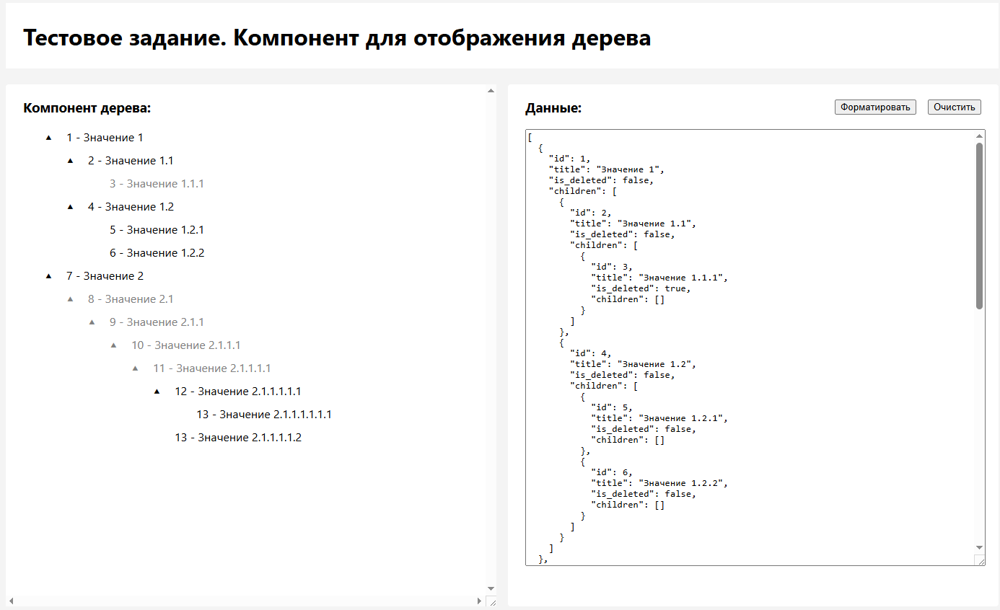

# Тестовое задание - Компонент для просмотра дерева

This project was generated using [Angular CLI](https://github.com/angular/angular-cli) version 19.2.4.

## Запуск приложения

Для запуска приложения:

- Склонировать репозиторий
- Перейти в папку с проектом в терминале
- Выполнить команду `npm install`
- Выполнить команду `npm run start`
- В браузере перейти по адресу http://localhost:4200/

## Интерфейс приложения

Интерфейс приложения разделен на 2 части:

- Дерево данных (в левой части экрана)
- Поле ввода данных (в правой части экрана)

При изменении данных в поле вода компонент дерева автоматически обновляется, добавляя новые узлы или удаляя существующие (при необходимости).

## Скриншоты

